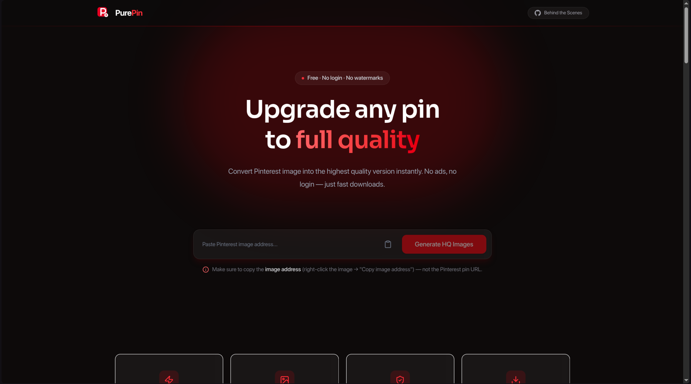
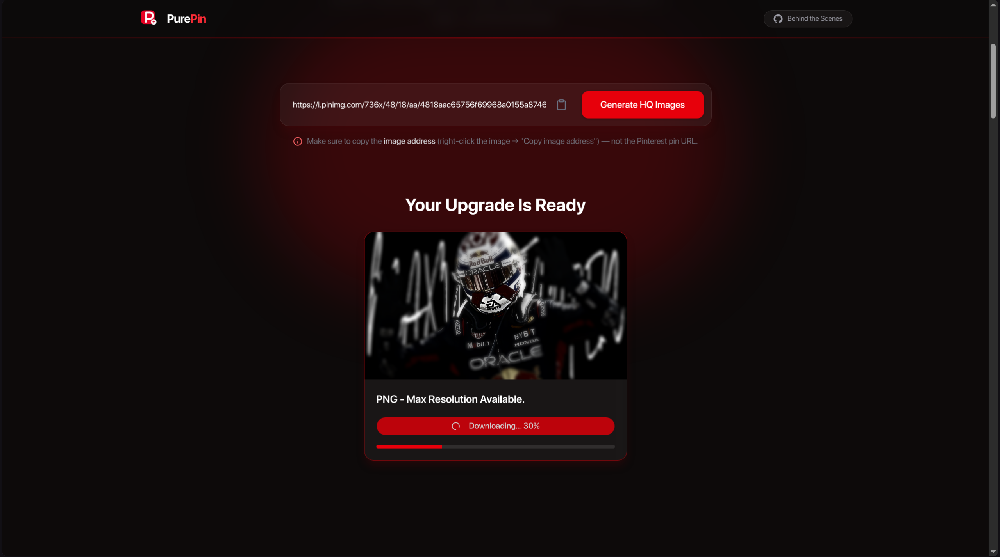

# PurePin

PurePin is a simple, fast web app for downloading high-resolution images from Pinterest. Paste a Pinterest Image address URL and get the original, full-quality image in seconds — no watermarks, no signup, no hassle.

## 📸 Screenshots

|                Landing Page                 |                   Paste Image URL                   |                 Download Result                 |
| :-----------------------------------------: | :-------------------------------------------------: | :---------------------------------------------: |
|  |  |  |

## ✨ Features

- 🔗 **Paste & Download** — Just paste a Pinterest image address and grab the original resolution image
- ⚡ **Fast & Lightweight** — Built for speed with a minimal, distraction-free UI
- 🎨 **Clean Interface** — Modern UI built with shadcn/ui and Tailwind CSS
- ✅ **Input Validation** — Robust URL validation powered by Zod
- 📱 **Responsive Design** — Works seamlessly across desktop and mobile
- 🎥 **Demo Video** — In-app walkthrough showing exactly how to use the tool
- ❓ **FAQ Section** — Answers to common questions about usage and limitations
- 📊 **Analytics** — Integrated with Vercel Analytics for usage insights

## 🛠️ Tech Stack

- **Framework:** [Next.js](https://nextjs.org/)
- **Language:** [TypeScript](https://www.typescriptlang.org/)
- **Styling:** [Tailwind CSS](https://tailwindcss.com/)
- **UI Components:** [shadcn/ui](https://ui.shadcn.com/)
- **Validation:** [Zod](https://zod.dev/)
- **Analytics:** [Vercel Analytics](https://vercel.com/analytics)
- **Deployment:** [Vercel](https://vercel.com/)

## 📁 Project Structure

purepin/
├── src/
│ ├── app/
│ │ ├── api/
│ │ │ ├── download/
│ │ │ │ └── route.ts # Handles image download requests
│ │ │ └── resolve/
│ │ │ └── route.ts # Resolves Pinterest pin URLs
│ │ ├── privacy/ # Privacy policy page
│ │ ├── terms/
│ │ │ └── page.tsx # Terms of service page
│ │ ├── favicon.ico
│ │ ├── globals.css
│ │ ├── layout.tsx
│ │ └── page.tsx # Landing page
│ ├── components/
│ │ ├── Home/
│ │ │ ├── AboutSection.tsx
│ │ │ ├── DemoVideo.tsx
│ │ │ ├── DeviceGuide.tsx
│ │ │ ├── EmptyState.tsx
│ │ │ ├── FAQ.tsx
│ │ │ ├── Features.tsx
│ │ │ ├── Hero.tsx
│ │ │ ├── HowItWorks.tsx
│ │ │ ├── ImageCard.tsx
│ │ │ ├── ResultGrid.tsx
│ │ │ └── UrlInput.tsx
│ │ ├── layout/
│ │ │ ├── Footer.tsx
│ │ │ └── Navbar.tsx
│ │ └── ui/ # Reusable shadcn/ui components
│ ├── lib/
│ │ ├── pinterest.ts # Pinterest scraping/resolution logic
│ │ ├── utils.ts # Shared utility functions
│ │ └── validation.ts # Zod schemas for input validation
│ └── types/
│ └── index.ts # Shared TypeScript types
├── public/ # Static assets
├── AGENTS.md
├── CLAUDE.md
├── components.json
├── eslint.config.mjs
├── next.config.ts
├── package.json
├── postcss.config.mjs
└── tsconfig.json

## 🚀 Getting Started

### Prerequisites

- Node.js 18+
- npm / yarn / pnpm

### Installation

1. Clone the repository

```bash
   git clone https://github.com/Czar-16/purepin.git
   cd purepin
```

2. Install dependencies

```bash
   npm install
```

3. Run the development server

```bash
   npm run dev
```

4. Open [http://localhost:3000](http://localhost:3000) in your browser

## 📖 Usage

1. Find a Pinterest pin you want to download
2. Copy the pin's URL
3. Paste it into PurePin's input field
4. Click download and get the high-resolution image instantly

## 🤔 FAQ

**Is this legal?**
PurePin is intended for personal use — downloading publicly available images for reference, inspiration, or offline viewing. Please respect content creators' rights and Pinterest's terms of service.

**Why isn't my image downloading?**
Make sure you're pasting a valid Pinterest pin URL. Some pins may be private or restricted.

## 📄 License

This project is licensed under the MIT License.

## 🙋‍♂️ Author

Built by [Czar16](https://x.com/itsCzar16) — follow along for more build-in-public updates.
